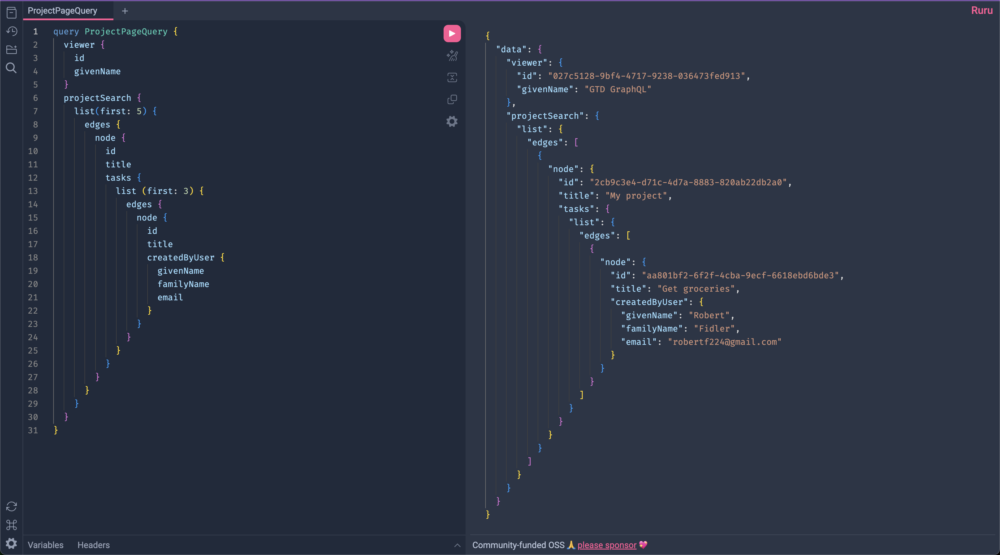

# foundry-tools

### Projects

### osdk-react

OSDK x React integration with automatic client state management, built on top of TanStack Query.

```tsx
import {
    useAction,
    useLiveObjectSet,
    useObjects,
    isKnownActionError,
    useAggregations,
} from "@bobbyfidz/osdk-react";
import { createTask, Task } from "@gtd/sdk";
import React, { Suspense } from "react";
import TaskItem from "./TaskItem";

function App() {
    // Load objects with Suspense.
    const {
        data: tasks,
        hasNextPage,
        isFetchingNextPage,
        fetchNextPage,
    } = useObjects(Task, {
        $orderBy: { completedAt: "asc", createdAt: "desc" },
        $pageSize: 10,
    });
    // Subscribe to real-time updates.
    useLiveObjectSet(Task);

    // Wire up Action types.
    const { mutate: addTask, isPending } = useAction(createTask);
    const [newTaskTitle, setNewTaskTitle] = React.useState("");

    const handleAddTask = () => {
        if (!newTaskTitle.trim()) return;
        // Submit Actions.
        addTask(
            { title: newTaskTitle },
            {
                onSuccess: () => setNewTaskTitle(""),
                onError: (error) => console.error(error),
            }
        );
    };

    return (
        <div>
            <h1>Tasks</h1>
            <div>
                {tasks.map((task) => (
                    <TaskItem task={task} />
                ))}
                {hasNextPage && <button disabled={isFetchingNextPage}>Load more</button>}
            </div>
            <div>
                <input
                    type="text"
                    value={newTaskTitle}
                    onChange={(e) => setNewTaskTitle(e.target.value)}
                    placeholder="Add a new task..."
                />
                <button onClick={handleAddTask} type="button" disabled={isPending}>
                    {isPending ? "Adding..." : "Add Task"}
                </button>
            </div>
        </div>
    );
}

export default App;
```

### foundry-graphql

Turn Foundry + your Ontology into a fully typed GraphQL schema.


