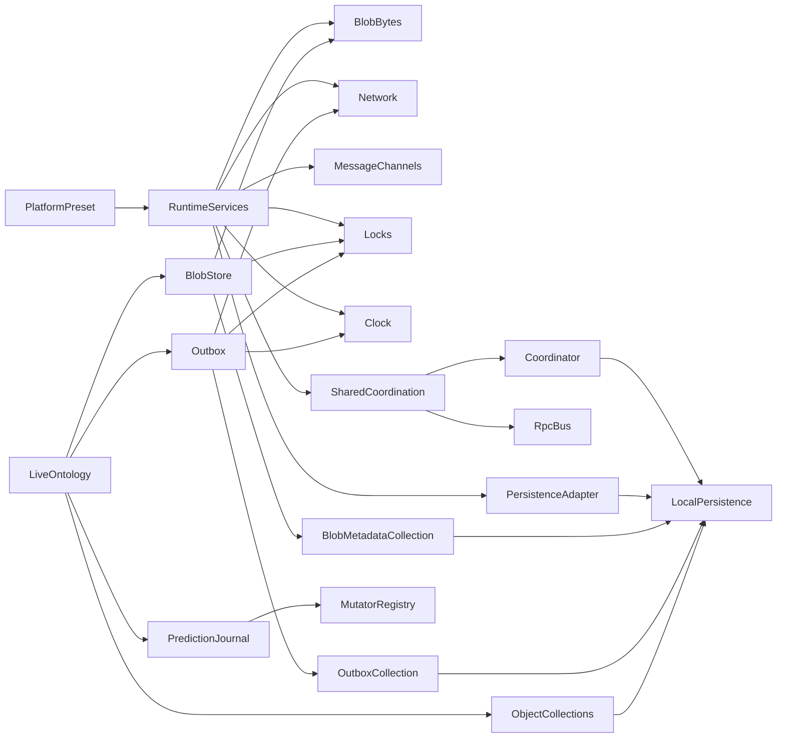

# Live runtime services, durable outbox, and replayable mutators

## Status

Proposed implementation specification.

This document is intended to be the handoff for the complete body of work. Implement it in the passes described below rather than as one large change.

## Summary

Live ontologies currently accept a high-level blob-store factory while constructing most runtime behavior internally. The `rf/runtimes` branch explored a broader runtime object, persistence presets, an offline executor, and async mutators, but its runtime boundary is too coarse and its outbox is not connected to ontology actions.

The target design has four layers:

1. Small platform runtime services: blob bytes, network monitoring, message channels, locks, clock, and raw collection persistence.
2. Higher-level reusable facilities built from those services: blob storage and a durable outbox.
3. Live ontology integration: platform presets, durable semantic action requests, and adapter reconciliation.
4. Replayable optimistic mutation programs: declarative action logic and named async mutators sharing one transaction API.

The first implementation pass is deliberately limited to runtime services, platform presets, blob migration, and LiveOntology wiring. The outbox and mutator work follows after those contracts are proven.

## Naming

Use:

- Package: `@party-stack/runtime-services`
- Spec/directory: `live-runtime-services-outbox-mutators`
- Public concepts:
  - `RuntimeServices`
  - `RuntimeServicesProvider`
  - `LockManager`
  - `MessageChannels`
  - `Clock`
  - `BlobBytesStore`
  - `NetworkMonitor`
  - `PersistenceAdapter`
  - `PersistedCollectionPersistence`
  - `Outbox`
  - `OntologyMutatorTx`
  - `OntologyActionRequest`

“Local runtime” is too vague, and “offline runtime” incorrectly excludes online scenarios. The longer name is preferable because it identifies the three related but separate deliverables.

## Background and current state

### Live ontology

[`packages/ontology/src/live/LiveOntology.ts`](../../packages/ontology/src/live/LiveOntology.ts) is the current composition root.

It:

- Resolves a `blobStore` factory by `{ owner, namespace }`.
- Defaults to an in-memory BlobStore.
- Constructs `BlobManager` internally.
- Creates object collections from `OntologyAdapter.getCollectionOptions`.
- Creates actions with separate `mutationFn` and synchronous `mutator` closures.
- Delegates remote attachment reads to `OntologyAdapter.attachments`.

Generated live modules expose only the existing `blobStore`, `context`, `getUserId`, and `id` options.

### Blob storage

The current blob redesign is already landed on the main/current branch. Do not re-port it from `rf/runtimes`.

It already separates:

- `BlobBytesAdapter`
- `BlobMetadataAdapter`
- `BlobStore`
- `BlobManager`
- Web OPFS bytes
- Web IndexedDB metadata
- Expo filesystem bytes
- Expo SQLite metadata
- In-memory bytes and metadata
- Optional web upload locks
- Startup reconciliation

The next step is to move the truly generic platform capabilities out of the blob package and rebuild BlobStore from those capabilities. This is a rebase/refactor of landed work, not a rewrite of blob behavior.

### `rf/runtimes`

Do not merge or cherry-pick the branch wholesale.

Useful concepts to port selectively later:

- `OntologyMutatorTx`
- Serializable `OntologyEdit`
- Serializable `OntologyActionRequest`
- Named mutator resolution
- Async interpretation of declarative action logic
- Idempotency-key propagation
- SQLite atomic action execution
- Foundry staged-write handling

Do not port:

- The monolithic `LiveOntologyRuntime`.
- `startOfflineExecutor` as a runtime capability.
- Offline presets that initialize `mutationFns: {}`.
- Implicit `context.userId` in place of typed context and `getUserId`.
- Duplicate synchronous and async action interpreters.

### TanStack persistence

`persistedCollectionOptions` supports:

- Wrapping a synced collection.
- Creating a local-only persisted collection.
- Stable collection IDs and schema versions.
- A `PersistenceAdapter`.
- A `PersistedCollectionCoordinator`.
- Multi-instance mutation routing and invalidation.

`PersistenceAdapter` is collection-scoped. It does not make multiple ontology collections and attachment rows commit atomically. [`packages/sqlite-ontology/src/index.ts`](../../packages/sqlite-ontology/src/index.ts) remains the local atomic ontology adapter until a domain action journal provides equivalent recovery.

## Goals

- Replace `blobStore` injection with lower-level scoped runtime services.
- Keep runtime services independent of ontology concepts.
- Keep platform dependencies out of `@party-stack/ontology`.
- Support memory, web, and Expo implementations through presets.
- Expose named lock ownership as a platform capability, implemented with Web Locks in browsers.
- Expose best-effort message channels as a platform capability, implemented with BroadcastChannel in browsers.
- Build the RPC and persistence coordination required by local collections once in shared code above those capabilities.
- Back blob metadata and the future outbox with local-only TanStack collections.
- Make the future outbox durable, FIFO, retryable, and idempotent.
- Preserve immediate/eager execution while adding durability.
- Support async declarative and custom optimistic mutators.
- Recompute later optimistic mutations when an earlier mutation resolves.
- Make resource ownership and cleanup explicit.
- Provide Effection wrappers without making Effection part of the core contracts.

## Non-goals

- Do not create a generic distributed-systems framework.
- Do not expose platform message channels or locks directly as LiveOntology domain APIs; they are an SPI used by shared infrastructure.
- Do not treat message channels as durable messaging or authoritative state.
- Do not replace `sqlite-ontology` cross-collection transactions with per-collection persistence.
- Do not use serialized TanStack `PendingMutation` objects as durable action records.
- Do not make TanStack Store part of the NetworkMonitor contract.
- Do not preserve the current `blobStore` option or old platform BlobStore factory APIs.
- Do not merge `rf/runtimes` wholesale.
- Do not implement arbitrary native IndexedDB dynamic indexes in the first pass.
- Do not solve action drafts in this project. The outbox should compose with [`specs/2026-06-16-action-drafts/README.md`](../2026-06-16-action-drafts/README.md) through blob retention.

## Architecture



### SPI versus shared protocols

`RuntimeServices` is a service-provider interface implemented by each host platform. Its capabilities describe what the platform can do; they do not encode Party Stack coordination policy.

Shared code composes the SPI into:

- RPC over message channels.
- TanStack `PersistedCollectionCoordinator`.
- `PersistedCollectionPersistence`.
- Outbox scheduling and retry.

BlobStore, Outbox, and LiveOntology consume those shared facilities. They should not invent platform-specific BroadcastChannel messages or Web Lock names.

### Public runtime boundary

```ts
interface RuntimeScope {
    owner: string;
    namespace: string;
}

interface RuntimeServices {
    blobBytes: BlobBytesStore;
    network: NetworkMonitor;
    channels: MessageChannels;
    locks: LockManager;
    clock: Clock;
    persistence: PersistenceAdapter;
    dispose(): void | Promise<void>;
}

type RuntimeServicesProvider = (
    scope: RuntimeScope
) => RuntimeServices | Promise<RuntimeServices>;
```

Rules:

- `owner` is produced by `getUserId(context)`.
- `namespace` is the stable live ontology ID.
- Live ontology IDs must be explicit and stable when durable services are used.
- `createLiveOntology` becomes asynchronous because platform services may open databases, workers, channels, and filesystem handles.
- A LiveOntology owns the `RuntimeServices` instance returned by its provider and disposes it during `cleanup`.
- A provider that shares resources must implement its own reference counting behind the returned handle.
- Keep the existing typed generic `Context` and `getUserId`; do not require a `context.userId` convention.
- Shared setup generates a per-instance node ID, derives one `PersistedCollectionPersistence` from the runtime SPI, and passes that derived facility to internal collections.

## Core service contracts

### LockManager

The initial contract intentionally follows the small Web Locks subset needed by blob coordination, persistence coordination, and the future outbox.

```ts
interface Lock {
    readonly name: string;
}

interface LockOptions {
    ifAvailable?: boolean;
    signal?: AbortSignal;
}

interface LockManager {
    request<T>(
        name: string,
        callback: (lock: Lock) => T | PromiseLike<T>
    ): Promise<T>;

    request<T>(
        name: string,
        options: LockOptions,
        callback: (lock: Lock | null) => T | PromiseLike<T>
    ): Promise<T>;
}
```

Semantics:

- Locks are exclusive and held only while the callback is running.
- `ifAvailable` invokes the callback with `null` instead of waiting.
- Aborting a queued request rejects it.
- Returning or throwing releases the lock.
- The web implementation coordinates same-origin browser contexts through `navigator.locks`.
- The memory and initial Expo implementations coordinate only their JS runtime. Document this limitation on those presets; do not add capability metadata until shared code needs to inspect it.
- Shared/read modes, lock queries, and stealing are deferred until a concrete use case requires them.

Initial lock names:

- `party-stack:${owner}:${namespace}:blob:${blobId}:upload`
- `party-stack:${owner}:${namespace}:blobs:reconcile`
- `party-stack:${owner}:${namespace}:outbox:${queueId}:drain`
- Persistence coordinator names remain internal to that coordinator.

The shared layer may describe a callback as “owning” work while its lock is held, but ownership is not a separate platform capability.

### MessageChannels

```ts
interface MessageChannels {
    open<Message>(name: string): MessageChannel<Message>;
}

interface MessageChannel<Message> {
    publish(message: Message): void | Promise<void>;
    subscribe(listener: (message: Message) => void): () => void;
    close(): void;
}
```

Semantics:

- Named, multi-party, and one-to-many.
- Best effort and non-durable.
- Messages may be duplicated, reordered across senders, or missed.
- Messages must be valid for the platform transport, structured-cloneable on the web.
- `close` and unsubscribe are idempotent.
- Messages mean “something may have changed; reread durable state.”
- Messages must never be the sole authoritative copy of a durable mutation.

Implementations:

- Memory/one runtime: in-memory event bus.
- Web: BroadcastChannel.
- Expo: in-process event emitter initially; stronger native message channels can be added for multi-process hosts.

`MessageChannels` is not a Cap’n Web-style point-to-point duplex session. If a future RPC system needs ordered two-party byte streams, add a separate optional `DuplexConnection` capability rather than distorting these channels.

### Clock

```ts
interface Clock {
    now(): number;
    sleep(milliseconds: number, signal?: AbortSignal): Promise<void>;
}
```

Semantics:

- `now` supplies wall-clock timestamps for persisted records and retry scheduling.
- `sleep` is abortable.
- Memory tests can provide a deterministic fake; web and Expo use the system clock.

### BlobBytesStore

```ts
interface BlobBytesStore {
    put(key: string, value: Blob): Promise<void>;
    get(key: string): Promise<Blob | undefined>;
    delete(key: string): Promise<void>;
    list(): Promise<readonly string[]>;
}
```

Semantics:

- Values are bytes only; content type, file name, lifecycle state, and remote IDs live in metadata.
- `put` atomically replaces one complete value.
- `get` returns `undefined` for absence and throws for storage failures.
- `delete` is idempotent.
- `list` is required because blob reconciliation and GC depend on it.
- Keys are validated and encoded centrally instead of using raw IDs as platform filenames.
- The initial API reads and writes whole `Blob` values.
- Range reads/writes and streams are future additive capabilities; do not add placeholder options that no implementation honors.

Implementations:

- Memory: `Map<string, Blob>`.
- Web: OPFS.
- Expo: Expo filesystem.

### NetworkMonitor

```ts
type NetworkStatus = "online" | "offline" | "unknown";

interface NetworkMonitor {
    readonly status: NetworkStatus;
    subscribe(listener: (status: NetworkStatus) => void): () => void;
    dispose(): void;
}
```

Semantics:

- `status` is a synchronous snapshot.
- `subscribe` emits subsequent distinct changes; callers read `status` for the initial value.
- The unsubscribe function is idempotent.
- `dispose` is idempotent, removes platform listeners, and prevents later notifications.
- Network state is a scheduling hint, not proof that the target backend is reachable.
- Actual request failures determine success and retry classification.
- Implementations may also trigger a fresh available notification on visibility/foreground transitions, but duplicate state notifications should be documented and tested if allowed.

Implementations:

- Memory/online preset: fixed available network state.
- Web: `navigator.onLine`, online/offline events, and visible-tab retry triggers.
- Expo: NetInfo/AppState or an injected platform implementation.

Effection integration belongs in a separate entrypoint:

```ts
import type { Operation, Stream } from "effection";

function useNetworkMonitor(
    create: () => NetworkMonitor
): Operation<{
    network: NetworkMonitor;
    changes: Stream<NetworkStatus, void>;
}>;
```

The wrapper owns disposal and translates subscriptions into a scoped stream. The core runtime-services entrypoint must not depend on Effection.

### Shared coordination

Build the reusable protocol needed above `MessageChannels + LockManager + Clock`.

The initial shared coordination layer provides:

- Request/reply correlation over message channels.
- Timeouts and cancellation.
- A `PersistedCollectionCoordinator`.

The web runtime supplies raw IndexedDB or SQLite persistence plus platform SPI capabilities. Shared setup composes those into `PersistedCollectionPersistence`.

The coordinator uses:

- `LockManager` for collection ownership and writer exclusion.
- `MessageChannels` for ephemeral messages and follower/owner RPC.
- A generated per-coordinator node ID for sender and reply routing.
- `Clock` for request timeouts.
- Term, sequence, and row-version metadata.
- Persistence reload or `pullSince` when a sequence gap is observed.

Channel messages are not a source of truth and are not a durable message bus.

Generate node IDs with `crypto.randomUUID()` or an equivalent shared helper. Accept an optional `createId` in coordinator construction for deterministic tests and platforms lacking that global; do not add identity to `RuntimeServices` until a durable installation identity has a real consumer.

The Expo and memory presets may use `SingleProcessCoordinator` while their advertised lock scope remains runtime-local.

### IndexedDB scope

The first web IndexedDB `PersistenceAdapter` is intentionally limited to internal local-only collections such as blob metadata and outbox records.

It must still provide:

- Fixed object stores rather than dynamic store creation.
- Atomic `applyCommittedTx`.
- Idempotent replay/deduplication.
- Stable key encoding.
- Stream-position metadata.
- Collection metadata if required by `persistedCollectionOptions`.
- Full scans for eager hydration.
- Explicit schema-version/reset behavior.
- `blocked` and `versionchange` handling.
- Multi-tab coordination through the web coordinator.

It may:

- Evaluate supported subset filtering/order in memory.
- Treat `ensureIndex` as a recorded/no-op optimization when full scans remain semantically correct.

It must not:

- Silently return incorrect filtered, ordered, cursor, offset, or paginated subsets.
- Claim to replace SQLite persistence for general synced/on-demand collections.
- Use native dynamic IndexedDB index upgrades in the first pass.

Web/Expo offline object collection presets use the supported TanStack SQLite persistence implementations.

## Platform presets

### Memory

Provide:

- In-memory locks.
- In-memory message channels.
- In-memory blob bytes.
- Fixed-available network monitor.
- Fakeable/system clock.
- In-memory PersistenceAdapter.

Use for:

- Tests.
- Ephemeral server requests.
- Ontology explorer scenarios without durable local state.

### Web online

Provide:

- Web Locks adapter.
- BroadcastChannel message channels.
- OPFS blob bytes.
- Raw IndexedDB PersistenceAdapter for local-only internal collections.
- Browser network monitor.
- System clock.

“Online” means ontology object collections are not wrapped with offline persistence. Internal blob metadata and later outbox collections may still be durable.

If Web Locks are unavailable:

- Do not silently implement locking through message channels.
- Either return a clear capability error or require an explicitly named single-tab preset backed by in-memory locks.

### Web offline

Provide:

- The same web locks, message channels, blob bytes, network monitor, and clock.
- A raw TanStack browser SQLite PersistenceAdapter for ontology object collections and internal collections.
- Shared coordination composed into a correctly disposed `PersistedCollectionPersistence`.

Be careful with OPFS handle ownership across tabs. A lock does not by itself make multiple independently opened OPFS database handles safe. All non-owner adapter work must follow the coordinator/driver’s supported multi-tab model.

### Expo offline

Provide:

- Process/runtime-local locks, documented as such.
- In-process message channels.
- Expo filesystem blob bytes.
- Raw Expo SQLite persistence.
- Expo network monitor.
- System clock.
- Shared local persistence composed with `SingleProcessCoordinator`.

Open/close the SQLite database once per scoped runtime handle, not once per collection.

## First pass: runtime services and blobs

### Deliverables

1. Add `packages/runtime-services`.
2. Define the core interfaces above.
3. Add memory, web, and Expo entrypoints with isolated platform dependencies.
4. Add Effection wrappers in a separate entrypoint.
5. Add only the request/reply routing needed by the TanStack persistence coordinator; defer a general singleton-worker or coordination framework.
6. Add local-only persisted collection composition helpers.
7. Add the narrow IndexedDB PersistenceAdapter required by internal collections.
8. Move or adapt OPFS and Expo filesystem bytes implementations from `packages/blobs`.
9. Replace BlobMetadataAdapter platform implementations with a local-only persisted `BlobRef` collection.
10. Replace `BlobStore.withUploadLock` with `LockManager`.
11. Remove `blobStore` from `CreateLiveOntologyOpts`.
12. Make runtime services required through a scoped provider.
13. Make `createLiveOntology` and generated factories async.
14. Update all generated live modules, remote ontology wiring, server wiring, and apps.
15. Remove old web/Expo/memory BlobStore compatibility factories.

### Blob metadata collection

Create one stable local-only collection:

```ts
interface BlobRef {
    id: string;
    remoteId?: string;
    type: string;
    size: number;
    name?: string;
    state: BlobState;
    lastAccessedAt?: number;
    createdAt: number;
    updatedAt: number;
    error?: string;
}
```

Suggested collection ID:

```text
party-stack:${owner}:${namespace}:blobs:metadata
```

Requirements:

- Await collection readiness before adapter operations.
- Primary lookup by local ID.
- In-memory lookup/index by remote ID after eager hydration.
- State-filtered listing.
- Stable schema version.
- Cleanup through the runtime lifecycle.
- Preserve current blob-state transitions.

### Blob lifecycle

Preserve the existing saga/reconciliation design:

1. Write `staging` metadata.
2. Write bytes.
3. Write `staged` metadata.
4. On failure, write `failed` metadata when possible.
5. On startup, reconcile staging metadata and orphaned bytes.

Bytes and metadata cannot share one transaction, so partial states remain expected and tested.

Use locks for:

- Upload deduplication across contexts.
- One reconciliation pass per runtime scope.

Do not treat lock ownership as remote upload idempotency. A crash after a remote success but before local metadata update can still retry; the remote endpoint must eventually deduplicate by idempotency key.

### LiveOntology API

Target shape:

```ts
interface CreateLiveOntologyOpts<
    Context extends Record<string, unknown>
> {
    id: string;
    ir: OntologyIR;
    adapter: OntologyAdapter;
    runtime: RuntimeServicesProvider;
    context?: Context;
    getUserId?: (context: Context) => string;
}

async function createLiveOntology(...): Promise<LiveOntology>;
```

There is no compatibility `blobStore` property.

`cleanup` order:

1. Stop future action/query work.
2. Clean object collections.
3. Clean BlobManager/attachment work.
4. Clean adapter resources.
5. Dispose runtime services.

Cleanup remains safe if initialization partially failed.

### First-pass tests

Add contract suites that every implementation can run:

- Lock exclusion.
- `ifAvailable`.
- Abort while waiting.
- Lock release after throw.
- Best-effort message-channel fan-out, unsubscribe, and close.
- Message payload cloneability on the web.
- Clock timestamps and abortable sleep.
- Bytes put/get/replace/delete/list.
- Key encoding.
- Network-state transitions, unsubscribe, and disposal.
- Runtime namespace isolation.
- Persistence atomic apply and replay deduplication.
- Two simulated web contexts serialize writes.
- Two simulated web contexts observe committed changes.
- Missed sequence triggers reload/recovery.
- IndexedDB blocked/versionchange behavior.
- Blob stage success/failure.
- Reconcile after metadata-only and bytes-only partial writes.
- Concurrent upload deduplication.
- GC and retention parity.
- LiveOntology passes the correct owner/namespace.
- LiveOntology cleanup disposes all owned resources once.

Preserve and update:

- `packages/blobs/src/index.test.ts`
- `packages/ontology/src/live/LiveOntology.test.ts`
- Attachment preparation tests.
- Live attachment tests.
- Remote ontology tests.
- SQLite ontology tests.

### First-pass exit criteria

- No remaining `blobStore` option.
- No ontology import of platform-specific blob factories.
- No platform-specific bytes implementation owned by the blob package.
- Existing attachment behavior remains green.
- Web and Expo packages build without bundling each other’s platform dependencies.
- Memory, web, and Expo runtime contracts pass.
- Build, lint, and tests pass for every changed package and app.

## Second pass: generic durable outbox

Create a separate higher-level package, tentatively `@party-stack/outbox`.

The outbox depends on:

- TanStack DB.
- Local-only persisted collection support.
- `LockManager`.
- `MessageChannels` for cross-context wake-up hints.
- `NetworkMonitor`.
- `Clock`.
- A retry policy.

It does not depend on ontology or blobs.

### Durable record

```ts
interface OutboxRecord<Payload = unknown> {
    version: 1;
    id: string;
    queueId: string;
    kind: string;
    payload: Payload;
    idempotencyKey: string;
    createdAt: string;
    attemptCount: number;
    nextAttemptAt: number;
    lastError?: {
        name: string;
        message: string;
    };
    metadata?: Record<string, unknown>;
}
```

Requirements:

- Payloads must be explicitly serializable and versioned.
- Handler functions are resolved by stable `kind`; functions are never persisted.
- Records are persisted before dispatch.
- Ordering is `createdAt`, then `id`.
- Processing is strict FIFO.
- A retriable head item blocks later items.
- One scoped lock owner prevents concurrent processing.
- Startup, enqueue, network, channel-message, and foreground hints attempt a drain.
- A permanent failure removes or archives the head according to explicit policy and unblocks the queue.
- Retriable failures atomically persist attempt state before releasing the drain.
- Unknown handler names are permanent configuration failures, not infinite retries.
- Queue clearing/removal is explicit and observable.

### No permanent leader requirement

The outbox does not need a long-lived elected leader:

1. Any context may request the drain lock.
2. The winner reads durable queue state and drains it.
3. Other contexts observe persisted collection changes and receive optional wake-up signals.
4. Closing or crashing a browser context releases its Web Lock.
5. Startup/network/foreground/enqueue triggers provide future drain attempts.

The persistence coordinator may still have its own leadership protocol. That is independent of outbox drain ownership.

### Retry behavior

Support:

- Exponential backoff.
- Optional jitter.
- Explicit `NonRetriableError`.
- Retry-after hints when available.
- Manual retry/reset.
- Network-state changes resetting delayed retries.

Do not assume `navigator.onLine` proves reachability.

Use the injected `Clock` for retry timestamps and abortable waits.

### Completion API

Enqueue should return a handle:

```ts
interface EnqueuedJob<Result = unknown> {
    id: string;
    persisted: Promise<void>;
    completed: Promise<Result>;
}
```

The in-memory completion promise exists only for the current process. Durable status and restart recovery come from the outbox collection.

### Outbox tests

- Persist-before-dispatch ordering.
- FIFO under concurrent enqueue.
- Cross-context drain contention.
- Retry head-of-line blocking.
- Permanent failure unblocks the next item.
- Crash after remote success and before local removal.
- Duplicate dispatch uses the same idempotency key.
- Unknown handler behavior.
- Startup restoration.
- Network unavailable/unknown to available transition.
- Disposal while waiting or running.
- Schema/version mismatch.

## Third pass: blob uploads through the outbox

Register a stable blob upload job kind.

The payload references bytes rather than embedding them:

```ts
interface BlobUploadPayload {
    blobId: string;
    target?: AttachmentTypeDef;
    actionId?: string;
}
```

Behavior:

- Enqueue upload work durably.
- Attempt it immediately when the network monitor suggests availability.
- Read bytes by `blobId` at execution time.
- Retain `blobId` while any outbox record references it.
- Mark blob metadata uploading/persisted/failed.
- Keep remote upload idempotency separate from local locking.
- Remove the BlobManager in-memory upload map once outbox/locks provide equivalent behavior.
- Let action submission wait on required attachment materialization when provider semantics require it.

Interaction with drafts:

- Active drafts retain referenced blob IDs.
- Queued outbox records retain referenced blob IDs.
- Blob GC unions both retention providers.

## Fourth pass: offline ontology collection presets

Add a generic object-collection persistence decorator at the point where stable collection ID and `getKey` are known:

[`packages/ontology/src/live/objects/createLiveOntologyObjectCollection.ts`](../../packages/ontology/src/live/objects/createLiveOntologyObjectCollection.ts)

Behavior:

- Compose adapter collection options first.
- Assign deterministic ontology/object-type collection ID.
- Apply `persistedCollectionOptions`.
- Preserve attachment-source decoration.
- Use per-object-type schema versions.

Presets:

- `web-online`: no object persistence wrapper.
- `web-offline`: browser SQLite persistence wrapper.
- `expo-offline`: Expo SQLite persistence wrapper.
- `memory`: no durable object persistence.

This persistence concerns cached/synced collection state. It does not by itself make remote action submission durable.

Cross-collection local action atomicity remains with `sqlite-ontology`.

Tests:

- Eager and on-demand hydration.
- Stable IDs across reload.
- Schema mismatch/reset policy.
- Adapter sync plus local persistence.
- Multi-tab commit propagation.
- Collection cleanup.
- Persisted attachment-source decoration.

## Fifth pass: queue ontology actions

### Semantic request

Persist a semantic command, not captured collection mutations:

```ts
interface OntologyActionRequest {
    version: 1;
    id: string;
    ontologyId: string;
    actionTypeName: string;
    parameters: Record<string, unknown>;
    attachmentUploads: Array<{
        attachmentId: string;
        target?: AttachmentTypeDef;
    }>;
    idempotencyKey: string;
    replayContext?: Record<string, unknown>;
}
```

Rules:

- Parameters must already be resolved and serialized into durable value forms.
- Attachment payloads contain IDs/targets, not bytes.
- Do not persist credentials or arbitrary runtime context.
- If prediction replay needs context, the application must explicitly provide a safe serializable `replayContext`.
- The action handler obtains current authenticated adapter context at execution time.
- Action request versions require migration or explicit rejection.

### Action outbox handler

The handler:

1. Loads referenced blob bytes.
2. Calls `OntologyAdapter.applyAction`.
3. Passes the stable idempotency key.
4. Records attachment ID mappings.
5. Waits for the adapter’s authoritative collection reconciliation barrier.
6. Completes the outbox job.

The adapter contract must define when authoritative data is visible. Returning merely because the server accepted a command is insufficient for removing optimistic state.

### Server idempotency

Do not enable automatic retry until the receiving side deduplicates.

Required behavior:

- Store idempotency key and final result in the same server transaction as the action when possible.
- Return the prior result for duplicate delivery.
- Keep a defined retention period.
- Scope keys by ontology/user/action domain as needed.

Transporting a key without server storage is not idempotency.

### Confirmed-first rollout

Implement:

1. Confirmed-only queued actions.
2. Declarative optimistic actions.
3. Custom async optimistic mutators.

This sequence isolates durable transport correctness from prediction correctness.

## Sixth pass: async and arbitrary mutators

### Mutator API

Port and refine the `rf/runtimes` concept:

```ts
interface OntologyMutatorTx {
    query<T>(
        build: (
            queryBuilder: InitialQueryBuilder,
            objects: Record<string, Collection<OntologyObject>>
        ) => unknown
    ): Promise<T>;

    mutate: Record<
        string,
        {
            create(object: Record<string, unknown>): Promise<void>;
            update(
                key: string | number,
                changes: Record<string, unknown> | OntologyPropertyChange[]
            ): Promise<void>;
            delete(key: string | number): Promise<void>;
        }
    >;
}

type OntologyActionMutator = (options: {
    tx: OntologyMutatorTx;
    args: Record<string, unknown>;
    context: Record<string, unknown>;
    actionTypeName: string;
}) => void | Promise<void>;
```

Requirements:

- Reads are local.
- Reads observe preceding writes in the same mutator.
- Writes are buffered as `OntologyEdit` values.
- A thrown mutator produces no applied optimistic edits.
- Mutators are resolved by stable names.
- The client and server may register different implementations.
- Declarative logic and custom mutators use the same async interpreter.
- Only explicit IR `mutator` steps invoke custom mutators. Do not also invoke an implicit action-named fallback that can double-apply declarative logic.

### Prediction source of truth

The durable action descriptor plus named mutator registry is the source of truth.

Captured `OntologyEdit` or TanStack `PendingMutation` values are derived prediction output. They may be cached for the current process but are never the only durable representation.

### Prediction journal

Maintain ordered pending action descriptors:

```ts
interface PredictionJournalEntry {
    actionRequest: OntologyActionRequest;
    transaction?: Transaction;
    edits?: OntologyEdit[];
}
```

Initial action flow:

1. Resolve and validate action parameters.
2. Run the predictor against the current authoritative state plus preceding predictions.
3. If prediction fails, do not enqueue.
4. Persist the semantic outbox record.
5. Apply the derived optimistic edits in a TanStack transaction.
6. Trigger outbox draining.

Reconciliation flow when head action A completes or permanently fails:

1. Roll back prediction transactions for all pending entries, tail to head.
2. Remove A from the journal.
3. If A succeeded, wait until authoritative collection state reflects A.
4. Re-run predictors for every remaining action in FIFO order.
5. Apply newly derived edits.
6. Surface any replay failure and define whether that entry becomes confirmed-only or permanently failed.

This is required because action B may read state affected by A. Reapplying B’s old captured edits is incorrect if A’s authoritative result differs from its prediction.

Restart flow:

1. Load semantic action records from the outbox.
2. Hydrate local authoritative collection state.
3. Resolve registered mutators.
4. Replay predictors FIFO.
5. Resume outbox draining.

### Query implementation

The branch implementation reconstructs temporary collections from all loaded and persisted rows for every query. That is acceptable as an initial correctness reference but not as an assumed scalable design.

First implementation may:

- Materialize only object types referenced by the query.
- Overlay buffered edits.
- Use TanStack query execution for semantics.

Later optimization may:

- Add transaction-native local query support.
- Query persistence directly.
- Cache snapshots across replay passes.

Do not optimize before the replay invariants are covered by tests.

### Mutator tests

- Async create/update/delete.
- Local query reads.
- Read-your-writes.
- Declarative and custom steps in explicit order.
- Missing mutator registration.
- Client/server implementation differences.
- Prediction throws before enqueue.
- A succeeds exactly as predicted.
- A succeeds with a different authoritative value; B is recomputed.
- A permanently fails; B is recomputed without A.
- A retries while B remains predicted.
- Restart restores and replays A/B.
- Attachment values survive planning and replay.
- Context serialization excludes credentials.

## Package and dependency boundaries

### `@party-stack/runtime-services`

Core dependencies:

- TanStack persistence types/core as a peer or direct dependency aligned with the installed TanStack DB version.

Subpath entrypoints:

- `.`
- `./coordination`
- `./memory`
- `./web`
- `./expo`
- `./effection`

Platform packages must not load through the core entrypoint.

### `@party-stack/blobs`

Depends on:

- `@party-stack/runtime-services`
- TanStack DB/persistence for the metadata collection

Does not own:

- OPFS implementation
- Expo filesystem implementation
- Web LockManager adapter
- Platform metadata databases

### `@party-stack/outbox`

Depends on:

- `@party-stack/runtime-services`
- TanStack DB/persistence

Does not depend on ontology or blobs.

### `@party-stack/ontology`

Depends on:

- Runtime service types
- Blobs
- Outbox after the action integration pass

Does not depend directly on:

- Expo
- OPFS/WASQLite browser packages
- BroadcastChannel adapters
- Offline-transactions package

## Resource ownership

Every long-lived resource must have one owner:

- Runtime preset owns databases, message channels, network listeners, queued lock cancellation, and platform handles.
- LiveOntology owns the runtime handle returned for its scope.
- BlobManager owns its scheduled GC work.
- Outbox owns timers, subscriptions, and active drain tasks.
- Object collections own their sync subscriptions.
- Adapter owns backend-specific resources.

Effection wrappers should provide scoped acquisition and cleanup internally, but all core APIs remain usable with ordinary JavaScript callbacks and promises.

Do not create a hidden global singleton unless its API explicitly implements reference counting and deterministic disposal.

## Correctness invariants

1. Durable work is persisted before remote dispatch.
2. Bytes and metadata may be partially written; reconciliation repairs or removes partial state.
3. Only one local context drains a queue at a time.
4. Channel messages are hints; persistence is authoritative.
5. Sequence gaps trigger durable recovery.
6. Retried remote effects use one stable idempotency key.
7. Server-side idempotency is committed with the domain action.
8. A retriable FIFO head blocks later work.
9. Blob GC cannot remove bytes referenced by drafts or outbox records.
10. Optimistic edits are derived from replayable semantic commands.
11. Removing one prediction reruns all later predictors.
12. Per-collection persistence is not presented as cross-collection atomicity.
13. Cleanup is idempotent and releases locks/listeners/handles.

## Failure scenarios to test

- Browser refresh after enqueue and before dispatch.
- Browser crash during remote request.
- Remote success with lost acknowledgement.
- Remote success before local outbox deletion.
- Permanent remote rejection.
- NetworkMonitor reports availability while the backend is unreachable.
- Two tabs enqueue simultaneously.
- Two tabs contend for blob upload.
- Lock-owning context closes during drain.
- Channel message is missed or duplicated.
- Persistence sequence gap.
- IndexedDB quota, blocked upgrade, and eviction.
- OPFS unavailable.
- Web Locks unavailable.
- Runtime cleanup during initialization.
- Runtime cleanup during retry sleep.
- Blob metadata written without bytes.
- Blob bytes written without metadata.
- Schema mismatch for local-only data.
- Missing mutator after application upgrade.
- Mutator schema/version migration.
- Authoritative result differs from optimistic prediction.

## Implementation order and handoff

Each pass should end in a reviewable, green state.

### Pass 1

Runtime services, platform presets, blob migration, and LiveOntology wiring.

Do not add outbox behavior.

### Pass 2

Generic durable outbox with conformance/failure tests.

### Pass 3

Blob upload jobs and outbox-driven blob retention.

### Pass 4

Offline ontology object collection presets.

### Pass 5

Confirmed-only durable ontology action requests, reconciliation barrier, and server idempotency.

### Pass 6

Declarative optimistic replay followed by arbitrary async mutators.

For each pass:

1. Re-read this spec and inspect changes made by earlier passes.
2. Update the spec if an implementation constraint invalidates a decision.
3. Add or update tests for every changed behavior.
4. Run build and lint after moving files or changing imports.
5. Run package tests.
6. Run workspace lint/tests required by `AGENTS.md` before merging.
7. Do not proceed to the next pass with known correctness gaps hidden behind TODOs.

## Expected first-pass file areas

New:

- `packages/runtime-services/package.json`
- `packages/runtime-services/src/types.ts`
- `packages/runtime-services/src/memory/`
- `packages/runtime-services/src/web/`
- `packages/runtime-services/src/expo/`
- `packages/runtime-services/src/effection/`
- `packages/runtime-services/src/persistence/`

Changed:

- `packages/blobs/src/types.ts`
- `packages/blobs/src/store/createBlobStore.ts`
- `packages/blobs/src/index.ts`
- `packages/blobs/src/web/`
- `packages/blobs/src/expo/`
- `packages/blobs/src/memory/`
- `packages/ontology/src/live/LiveOntology.ts`
- `packages/ontology/src/generate/live.ts`
- Generated live modules
- `packages/remote-ontology/src/client.ts`
- `packages/remote-ontology/src/server.ts`
- Application bootstrap call sites
- Package manifests and lockfile

Later:

- `packages/outbox/`
- `packages/ontology/src/live/actions/`
- `packages/ontology/src/live/mutators/`
- `packages/ontology/src/live/objects/createLiveOntologyObjectCollection.ts`
- Remote protocol and adapters
- Server idempotency storage

## References

- TanStack offline transactions: <https://github.com/TanStack/db/tree/main/packages/offline-transactions>
- TanStack persistence core: <https://github.com/TanStack/db/blob/main/packages/db-sqlite-persistence-core/src/persisted.ts>
- Zero mutators: <https://zero.rocicorp.dev/docs/mutators>
- Effection resources: <https://frontside.com/effection/guides/v4/resources/>
- Runtime SPI/ownership design discussion: <https://chatgpt.com/share/6a59d760-c2cc-83ea-95ad-93b3d7e306ee>
- Existing action draft spec: [`specs/2026-06-16-action-drafts/README.md`](../2026-06-16-action-drafts/README.md)

## Remaining design checkpoints

Resolve these at the beginning of the relevant pass, not during Pass 1:

- Exact persisted action result/status API exposed to product code.
- Safe `replayContext` serialization hooks.
- Archive versus delete policy for permanently failed outbox records.
- Retention period and storage location for server idempotency records.
- Whether replay failures downgrade an action to confirmed-only or permanently fail it.
- Performance threshold that justifies replacing temporary mutator query snapshots.
